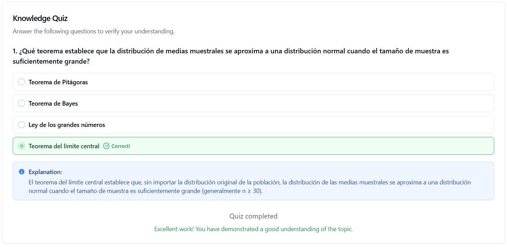

# 📊 Análisis Probabilístico de Comportamiento de Clientes en E-commerce
| Autor            | Fecha        | Día |
|------------------|--------------|----------|
| **Carlos Vásquez** |05 Enero 2026 | 1| 
## 📋 Descripción del Proyecto

Este proyecto realiza un análisis exhaustivo de distribuciones probabilísticas aplicadas al comportamiento de clientes en e-commerce, demostrando cómo diferentes distribuciones modelan distintos aspectos del comportamiento y validando el Teorema del Límite Central.

## 🎯 Objetivos

1. **Modelar eventos de conteo** usando distribución de Poisson (número de compras)
2. **Modelar valores monetarios** usando distribución log-normal (valor de compras)
3. **Demostrar el Teorema del Límite Central** mediante simulación de muestreo
4. **Validar modelos estadísticos** con tests de hipótesis
5. **Visualizar distribuciones** teóricas vs empíricas

## 🔧 Requisitos del Sistema

### Software Necesario
- Python 3.8 o superior
- pip (gestor de paquetes de Python)

### Librerías Requeridas

```bash
pandas>=1.5.0
numpy>=1.23.0
matplotlib>=3.6.0
scipy>=1.9.0
```

## 📦 Instalación

### Opción 1: Instalación Rápida

```bash
# Instalar todas las dependencias
pip install pandas numpy matplotlib scipy
```

### Opción 2: Usando requirements.txt

Crear un archivo `requirements.txt`:

```
pandas>=1.5.0
numpy>=1.23.0
matplotlib>=3.6.0
scipy>=1.9.0
```

Instalar:

```bash
pip install -r requirements.txt
```

### Opción 3: Usando Entorno Virtual (Recomendado)

```bash
# Crear entorno virtual
python -m venv venv

# Activar entorno virtual
# En Windows:
venv\Scripts\activate
# En Mac/Linux:
source venv/bin/activate

# Instalar dependencias
pip install pandas numpy matplotlib scipy
```

## 🚀 Uso del Programa

### Ejecución Básica

```bash
python analisis_probabilistico.py
```

### Ejecución en Jupyter Notebook

```bash
# Instalar Jupyter
pip install jupyter

# Iniciar Jupyter
jupyter notebook

# Abrir el notebook y ejecutar las celdas
```

## 📁 Estructura del Proyecto

```
analisis-probabilistico-ecommerce/
│
├── analisis_probabilistico.py          # Script principal
├── README.md                            # Este archivo
├── requirements.txt                     # Dependencias
│
├── analisis_interactivo.ipynb # Notebooks opcionales 
│
└── distribuciones_probabilidad_clientes.png                   
    
```

## 📊 Salidas del Programa

### 1. Consola
El programa imprime en consola:
- Estadísticas descriptivas del dataset
- Análisis de distribución de Poisson
- Análisis de distribución Log-normal
- Resultados del Teorema del Límite Central
- Tests de hipótesis y p-valores
- Intervalos de confianza

### 2. Archivo de Imagen
Genera `distribuciones_probabilidad_clientes.png` con 4 gráficos:
- **Gráfico 1**: Distribución de Poisson (compras)
- **Gráfico 2**: Distribución Log-normal (valores)
- **Gráfico 3**: Teorema del Límite Central
- **Gráfico 4**: Q-Q Plot (normalidad)

## 🧪 Tests Estadísticos Incluidos

### 1. Test Chi-cuadrado de Bondad de Ajuste
- **Propósito**: Verificar si los datos siguen una distribución de Poisson
- **Hipótesis nula**: Los datos siguen distribución de Poisson
- **Criterio**: p-valor > 0.05 → No rechazar H₀

### 2. Test de Normalidad (D'Agostino-Pearson)
- **Propósito**: Verificar normalidad de valores de compra
- **Hipótesis nula**: Los datos son normales
- **Criterio**: p-valor < 0.05 → Rechazar H₀ (NO es normal)

### 3. Test de Log-normalidad
- **Propósito**: Verificar si log(valores) es normal
- **Aplicación**: Valida el uso de distribución log-normal
- **Criterio**: p-valor > 0.05 → Los datos son log-normales

### 4. Test de Normalidad de Medias Muestrales
- **Propósito**: Validar el Teorema del Límite Central
- **Resultado esperado**: Las medias SÍ deben ser normales

## 📈 Conceptos Estadísticos Explicados

### Distribución de Poisson
```
P(X = k) = (λ^k × e^(-λ)) / k!
```
- **Uso**: Modelar conteos de eventos en tiempo fijo
- **Parámetro λ**: Promedio de eventos (compras/año)
- **Características**: Discreta, asimétrica, valores ≥ 0

### Distribución Log-normal
```
Si log(X) ~ Normal(μ, σ²) → X ~ Log-normal
```
- **Uso**: Modelar valores monetarios, precios, ingresos
- **Características**: Continua, asimétrica positiva, valores > 0
- **Ventaja**: Modela bien datos con outliers positivos

### Teorema del Límite Central
```
X̄ ~ Normal(μ, σ²/n)  cuando n → ∞
```
- **Importancia**: Justifica uso de métodos paramétricos
- **Condición**: n ≥ 30 (regla práctica)
- **Aplicación**: Intervalos de confianza, pruebas de hipótesis

## 🔍 Interpretación de Resultados

### Ejemplo de Salida Típica

```
P(0 compras/año): 0.0821 (8.21%)
P(1 compra/año):  0.2052 (20.52%)
P(5+ compras/año): 0.1088 (10.88%)

Test Chi-cuadrado:
  P-valor: 0.4521
  Conclusión: Poisson es un buen modelo ✓

Intervalo de Confianza (95%):
  [$215.34, $247.89]
  Media poblacional: $231.56
  Dentro del IC: ✓ SÍ
```

### ¿Qué Significan los Resultados?

1. **p-valor > 0.05**: El modelo se ajusta bien a los datos
2. **p-valor < 0.05**: El modelo NO se ajusta (rechazar)
3. **IC contiene μ**: El estimador es confiable
4. **Q-Q Plot lineal**: Los datos son normales

## 💡 Aplicaciones Prácticas

### En E-commerce
- **Predicción de demanda**: Usar Poisson para forecast de pedidos
- **Segmentación de clientes**: Identificar patrones de compra
- **Optimización de inventario**: Modelar variabilidad de ventas
- **Pricing estratégico**: Analizar distribución de valores

### En Marketing
- **CLV (Customer Lifetime Value)**: Estimar valor futuro
- **Campañas dirigidas**: Identificar clientes de alto valor
- **A/B Testing**: Comparar grupos con TLC

### En Finanzas
- **Análisis de riesgo**: Modelar pérdidas con log-normal
- **Portfolio optimization**: Distribución de retornos
- **Credit scoring**: Probabilidad de default


### ¿Por qué usar Poisson en vez de Normal para compras?
Porque las compras son **eventos discretos** (0, 1, 2...) y la Poisson modela conteos en tiempo fijo.

### ¿Por qué Log-normal para valores monetarios?
Porque los valores son **siempre positivos** y tienen **asimetría positiva** (algunos clientes gastan mucho más).

### ¿Qué tamaño de muestra necesito para el TLC?
**n ≥ 30** es la regla práctica. Con n=50 ya funciona muy bien.

### ¿Puedo usar este código con mis propios datos?
¡Sí! Reemplaza la sección de generación de datos con:
```python
df = pd.read_csv('mis_datos.csv')
```

### ¿Cómo interpreto el p-valor?
- **p < 0.05**: Evidencia significativa contra H₀
- **p > 0.05**: No hay evidencia suficiente para rechazar H₀

## Test o Prueba
